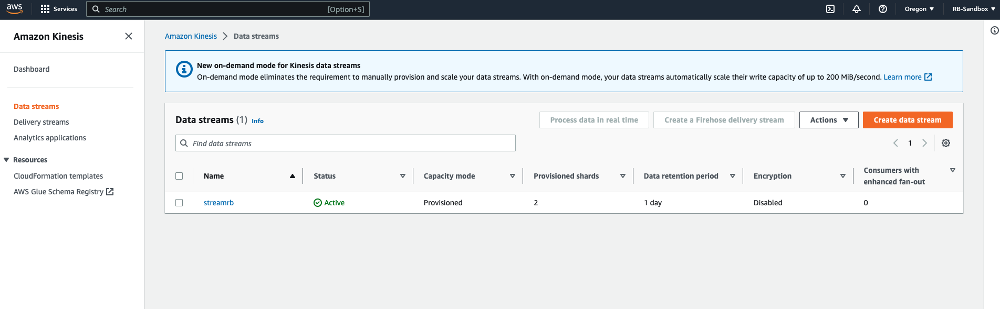
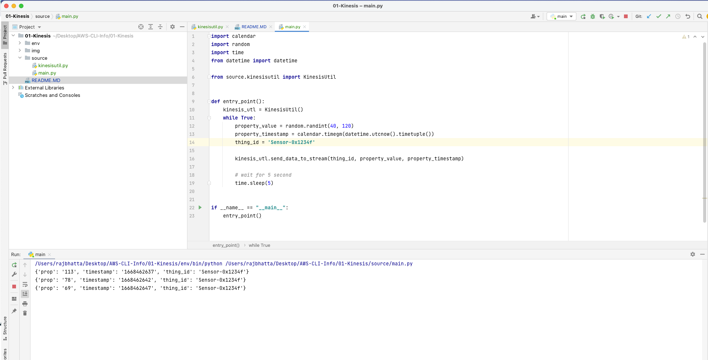

# 1. Creating Kinesis Stream and Producer using Kinesis #
```js
aws kinesis create-stream --stream-name streamrb --shard-count 2
```




# 2. Create virtual environment #
```python
python3 -m venv env
```

# 3. Install Boto3 Dependency #
```python
pip install boto3
```

# 2. Code to connect to Kinesis stream and send data using Boto3 #
```python

1. stream_producer / kinesisutil.py

import json

import boto3 as boto3
import kinesis as kinesis
import sys

from random import seed
from random import randint
import time
import random

class KinesisUtil():

    def __init__(self):
        self.__kinesis_client = boto3.client('kinesis', region_name='us-west-2')

    def send_data_to_stream(self,thing_id, property_value, property_timestamp):
        payload = {
            'prop': str(property_value),
            'timestamp': str(property_timestamp),
            'thing_id': thing_id
        }

        print(payload)

        put_response = self.__kinesis_client.put_record(
            StreamName='streamrb',
            Data=json.dumps(payload),
            PartitionKey=thing_id)

```

```python

2. stream_producer / main.py

import calendar
import random
import time
from datetime import datetime

from stream_producer.kinesisutil import KinesisUtil


def entry_point():
    kinesis_utl = KinesisUtil()
    while True:
        property_value = random.randint(40, 120)
        property_timestamp = calendar.timegm(datetime.utcnow().timetuple())
        thing_id = 'Sensor-0x1234f'

        kinesis_utl.send_data_to_stream(thing_id, property_value, property_timestamp)

        # wait for 5 second
        time.sleep(5)


if __name__ == "__main__":
    entry_point()
```

# Output #
