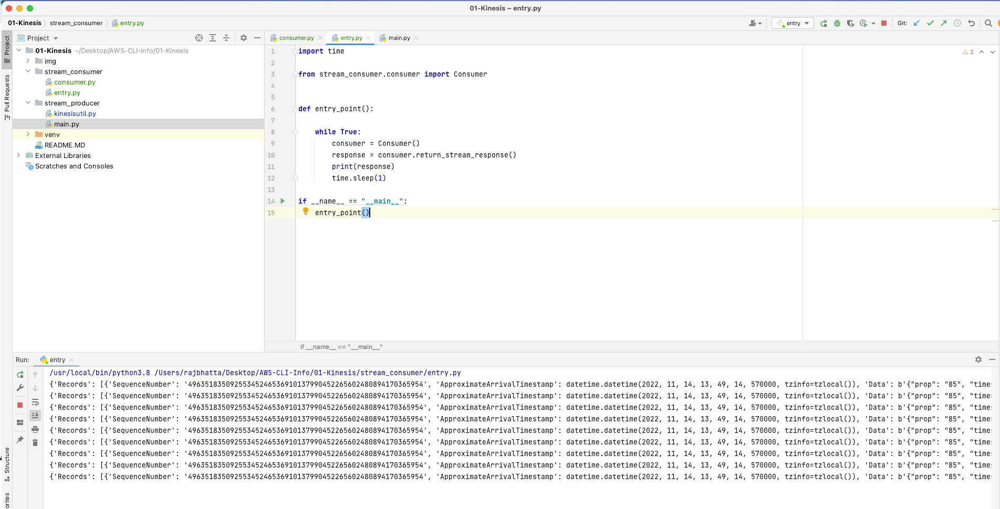
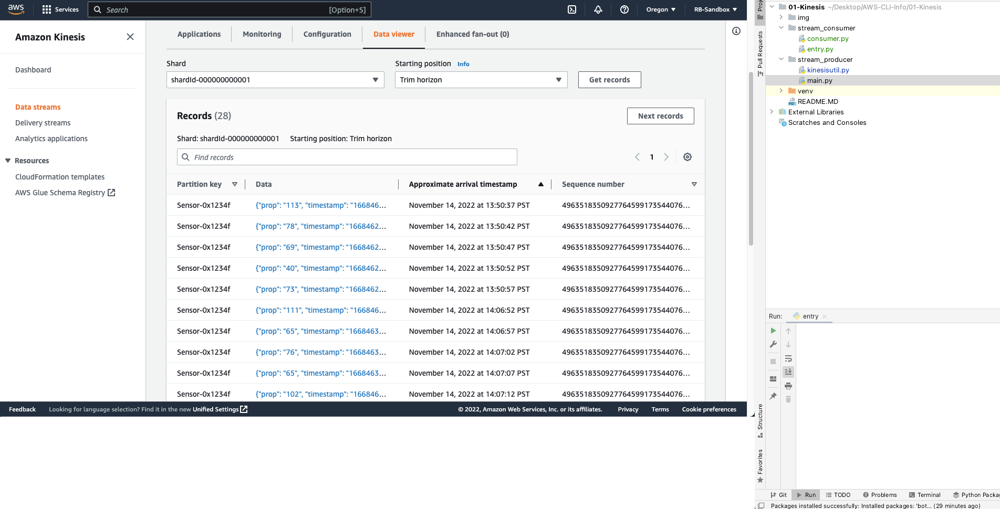

# 1. Creating Kinesis Stream and Producer using Python and AWS CLI #
```js
aws kinesis create-stream --stream-name streamrb --shard-count 2
```


## 2. Create virtual environment ##
```python
python3 -m venv env
```

## 3. Install Boto3 Dependency ##
```python
pip install boto3
```

## 2. Code to connect to Kinesis stream and send data using Boto3 ##
```python

1. stream_producer / kinesisutil.py

import json

import boto3 as boto3
import kinesis as kinesis
import sys

from random import seed
from random import randint
import time
import random

class KinesisUtil():

    def __init__(self):
        self.__kinesis_client = boto3.client('kinesis', region_name='us-west-2')

    def send_data_to_stream(self,thing_id, property_value, property_timestamp):
        payload = {
            'prop': str(property_value),
            'timestamp': str(property_timestamp),
            'thing_id': thing_id
        }

        print(payload)

        put_response = self.__kinesis_client.put_record(
            StreamName='streamrb',
            Data=json.dumps(payload),
            PartitionKey=thing_id)

```

```python

2. stream_producer / main.py

import calendar
import random
import time
from datetime import datetime

from stream_producer.kinesisutil import KinesisUtil


def entry_point():
    kinesis_utl = KinesisUtil()
    while True:
        property_value = random.randint(40, 120)
        property_timestamp = calendar.timegm(datetime.utcnow().timetuple())
        thing_id = 'Sensor-0x1234f'

        kinesis_utl.send_data_to_stream(thing_id, property_value, property_timestamp)

        # wait for 5 second
        time.sleep(5)


if __name__ == "__main__":
    entry_point()
```

## Output ##


# Code to read from producer in Kinesis #
```python

stream_consumer/consumer.py

import json

import boto3 as boto3

class Consumer():

    def __init__(self):
        """

        1. Create connection with kinesis
        2. Describe kinesis stream
        3. Select shard ID
        4. Get shard iterator
        5. Get record

        """
        self.__stream_name = 'streamrb'
        self.__kinesis_client = boto3.client('kinesis', region_name='us-west-2')
        self.__kinesis_response = self.__kinesis_client.describe_stream(StreamName=self.__stream_name)
        self.__shard_id =  self.__kinesis_response['StreamDescription']['Shards'][0]['ShardId']

        self.__shard_iterator = self.__kinesis_client.get_shard_iterator(StreamName=self.__stream_name,
                                                           ShardId=self.__shard_id,
                                                           ShardIteratorType='LATEST')

        self.__my_shard_iterator = self.__shard_iterator['ShardIterator']
        self.__record_response = self.__kinesis_client.get_records(ShardIterator=self.__my_shard_iterator,
                                                     Limit=2)


    def return_stream_response(self):
        while 'NextShardIterator' in self.__record_response:
            record_response = self.__kinesis_client.get_records(ShardIterator= self.__record_response['NextShardIterator'],
                                                         Limit=2)
            return record_response
```

```python

2. stream_consumer/entry.py

import time

from stream_consumer.consumer import Consumer


def entry_point():

    while True:
        consumer = Consumer()
        response = consumer.return_stream_response()
        print(response)
        time.sleep(1)

if __name__ == "__main__":
    entry_point()
```


