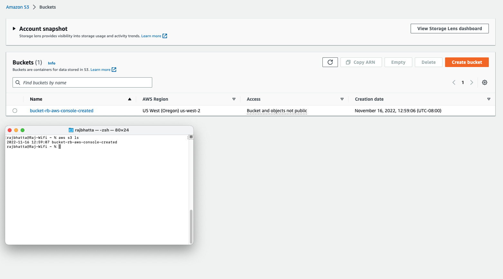

# Working with S3 bucket using AWS CLI #
## 1. Listing available s3 bucket ##
```aws
aws s3 ls
```


##2. Copying single file to s3 ##
```aws
aws s3 cp /Users/rajbhatta/Desktop/s3-transfer/data.xml s3://sensor-data/
```

## 3. Uploading multiple files and folders to S3 Recursively ##
- Using the <b> --recursive </b> option, all the contents of the <b> /Users/rajbhatta/Desktop/s3-transfer/ </b> folder will be uploaded to S3 while also retaining the folder structure.

```aws
aws s3 cp /User/rajbhatta/Desktop/s3-transfer s3://sensor-data --recursive
```

## 4. Uploading multiple files and folders to S3 selectively ##
```aws
aws s3 cp /User/rajbhatta/Desktop/s3-transfer s3://sensor-data --recursive --exclude * --include *.ps1
```
- exclude all file and include .ps1 


## 5. Uploading multiple file with different extension ##
```aws
aws s3 cp /User/rajbhatta/Desktop/s3-transfer s3://sensor-data --recursive --exclude * --include *.csv --include *.png
```

## 6. Downloading file from S3 object #
```aws
aws s3 cp s3://sensor-data /User/rajbhatta/Desktop/s3-transfer --recursive
```

## 7. Copying between S3 ##
```aws
aws s3 cp s3://sensor-data/Log1.xml s3://machine-data/
```

## Synchronizing file between folder and S3 ##
```aws
aws s3 sync /User/rajbhatta/Desktop/s3-transfer s3://sensor-data/ --exclude * --include *.xml
```
